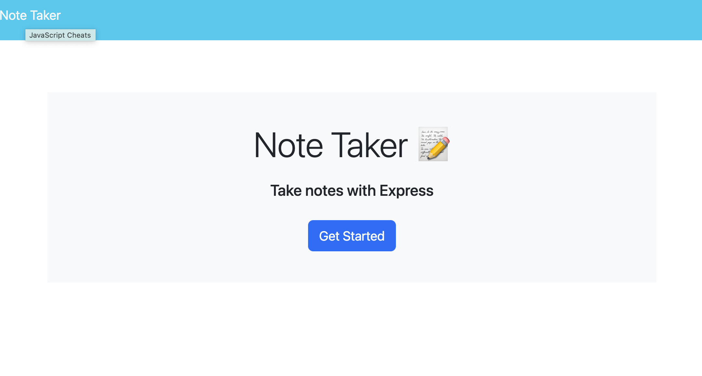
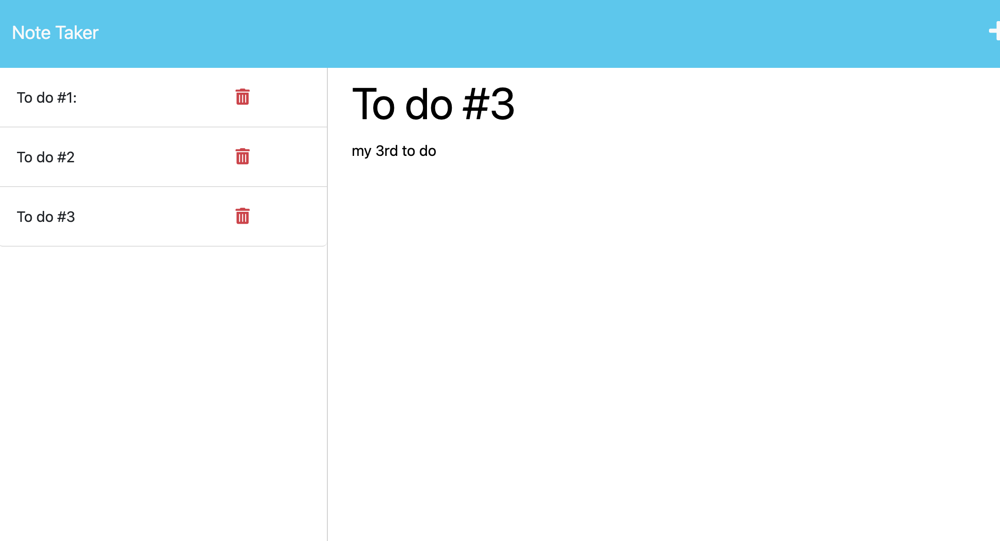

# Note-taker

  ## Description
  This project was built to demonstrate my knowledge of connecting front-end webpages with Express.js backend. This application allow users to POST, GET, and DELETE notes from an Heroku hosted server. 

  ## Table of Contents
  [Description](#description)

  [Installation](#installation)

  [Usage](#usage)

  [Credits](#credits)

  [Testing](#testing)

  [License](#license)

  [Questions](#questions)

  ## Installation 
  N/A

  ## Usage
  To use this Note Taker, please use the following link for the deployed application. 
  https://pacific-bayou-90667-492ff037dadb.herokuapp.com/
    
    
  
  ## Credits
  N/A 

  ## Testing
  N/A

  ## License
  A short and simple permissive license with conditions only requiring preservation of copyright and license notices. Licensed works, modifications, and larger works may be distributed under different terms and without source code.
  [https://opensource.org/license/mit/](https://opensource.org/license/mit/)
  ## Questions
  Please reach out to rileysong01, at [https://github.com/rileysong01](https://github.com/rileysong01) or at rsong47@uwo.ca for additional questions. 